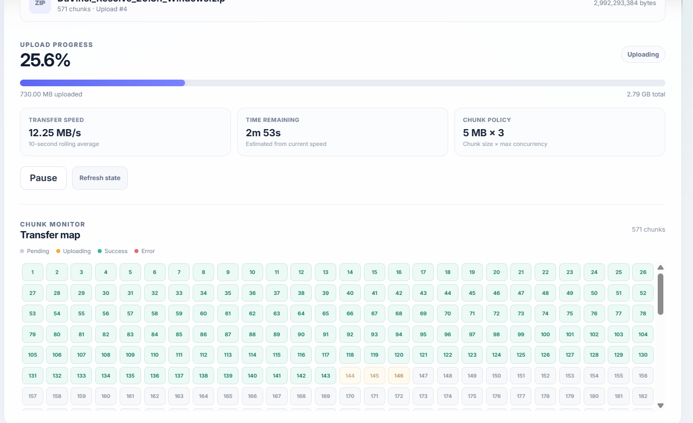
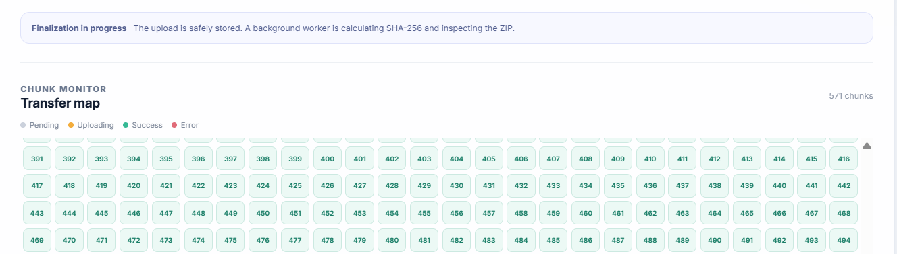
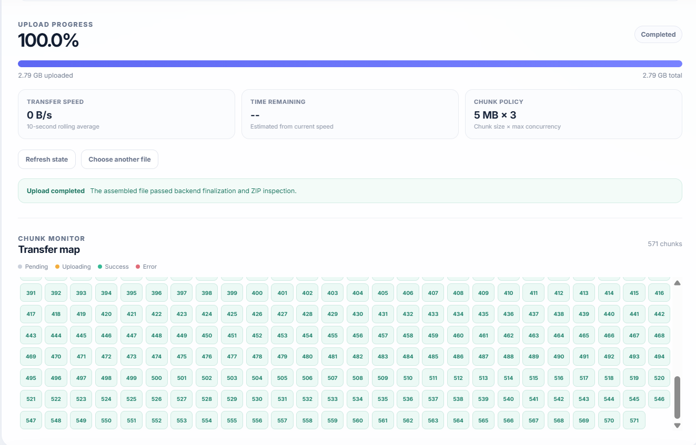
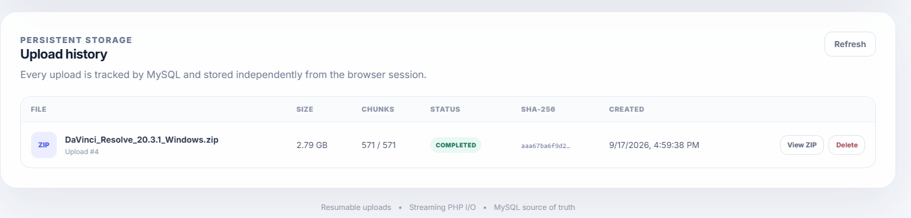

# 🚀 Large ZIP File Uploader

A production-oriented **resumable large-file upload system** built to
handle multi-gigabyte ZIP files reliably under unreliable network
conditions.

The project is designed around a simple principle:

> **Never make a large file upload depend on one long-running HTTP
> request.**

Instead, the browser splits the ZIP into **5 MiB chunks**, uploads up to
**3 chunks concurrently**, persists chunk state in **MySQL**, writes
bytes directly to a server-side file using **streaming I/O**, and
performs expensive finalization work asynchronously in a dedicated PHP
worker.

------------------------------------------------------------------------

## ✨ Highlights

-    Uploads ZIP files up to **10 GB**
-    Splits files into fixed **5 MiB chunks** using browser
    `Blob.slice()`
-    Uploads up to **3 chunks concurrently**
-    Resumes interrupted uploads using a persistent server-side
    handshake
-    Supports **out-of-order chunk arrival**
-    Idempotent duplicate-chunk handling
-    Retries transient failures up to **3 times**
-    Uses **exponential backoff + jitter**
-    Optional **30% transient network/server failure simulation**
-    Live global progress from **0--100%**
-    Live upload speed and ETA
-    Per-chunk status visualization: Pending / Uploading / Success /
    Error
-    Persists upload and chunk state in MySQL
-    Stores actual file bytes on a persistent Docker volume
-    Uses filesystem locking to coordinate concurrent PHP-FPM workers
-    Uses database row/advisory locks for safe finalization
-    Calculates server-side **SHA-256** of the assembled file
-    Inspects ZIP metadata without extracting the archive
-    Uses a background finalizer worker to avoid HTTP/PHP timeout
    problems
-    Automatically removes stale abandoned uploads
-    Provides persistent Upload History
-    Allows ZIP entry inspection from the UI
-    Supports safe deletion of completed/failed/in-progress uploads
-    Fully containerized with Docker Compose

------------------------------------------------------------------------

# 📸 Screenshots

## Upload in progress

The UI exposes global progress, uploaded bytes, live speed, ETA, current
lifecycle state, and individual chunk states.



## Server-side finalization

After all chunks have been uploaded, the API transitions the upload into
`PROCESSING`. A background worker calculates the SHA-256 checksum and
inspects the ZIP.







------------------------------------------------------------------------

# 🧠 Key Idea 

A basic file uploader usually does:

``` text
Browser
   │
   └── POST entire file ──► Server
```

That approach becomes fragile for multi-gigabyte files because a single
request can fail after a long period of uploading.

This project instead uses:

``` text
Browser
   │
   ├── Chunk 0 ────────────────┐
   ├── Chunk 1 ────────────────┤
   ├── Chunk 2 ────────────────┤
   │                           ▼
   │                        Nginx
   │                           │
   │                        PHP-FPM
   │                           │
   │                 ┌─────────┴─────────┐
   │                 ▼                   ▼
   │               MySQL             upload.bin
   │
   └── handshake / status / finalize
```

A failed chunk does not invalidate the entire upload.

If the browser is refreshed or the network disconnects, the backend
already knows which chunks succeeded. The same ZIP can be selected again
and the uploader continues from the persisted state.

------------------------------------------------------------------------

# 🏗️ Architecture

``` text
                         ┌─────────────────────┐
                         │     React Client    │
                         │                     │
                         │  useUploader Hook   │
                         │  - chunking         │
                         │  - concurrency      │
                         │  - retry/backoff    │
                         │  - progress         │
                         │  - pause/resume     │
                         └──────────┬──────────┘
                                    │
                                    │ HTTP
                                    ▼
                         ┌─────────────────────┐
                         │        Nginx        │
                         │                     │
                         │ reverse proxy /     │
                         │ FastCGI gateway     │
                         └──────────┬──────────┘
                                    │
                                    ▼
                         ┌─────────────────────┐
                         │      PHP-FPM        │
                         │                     │
                         │    index.php        │
                         │        │            │
                         │        ▼            │
                         │ UploadService.php   │
                         └──────┬───────┬──────┘
                                │       │
                    state       │       │ file bytes
                                ▼       ▼
                       ┌────────────┐  ┌──────────────┐
                       │   MySQL    │  │ Docker Volume│
                       │            │  │              │
                       │ uploads    │  │ upload.bin   │
                       │ chunks     │  │              │
                       └────────────┘  └──────────────┘
                                ▲
                                │
                         ┌──────┴───────┐
                         │ Finalizer    │
                         │ Worker       │
                         │              │
                         │ SHA-256      │
                         │ ZipArchive   │
                         └──────────────┘

                         ┌──────────────┐
                         │ Cleanup      │
                         │ Worker       │
                         │              │
                         │ stale upload │
                         │ removal      │
                         └──────────────┘
```

------------------------------------------------------------------------

# 🧰 Technology Stack


-   React 19
-   Vite
-   JavaScript
-   PHP 8.x
-   MySQL 8.4
-   Docker & Docker Compose
-   Nginx
-   XMLHttpRequest
-   Blob.slice()
-   PDO
-   ZipArchive
-   SHA-256
-   Persistent Docker Volumes

------------------------------------------------------------------------

# 🔄 End-to-End Upload Flow

## 1. Select a ZIP

The user selects a `.zip` file.

The frontend validates the extension and calculates the number of
chunks:

``` text
totalChunks = ceil(fileSize / 5 MiB)
```

For example:

``` text
100 MiB ZIP
÷
5 MiB chunks
=
20 chunks
```

------------------------------------------------------------------------

## 2. Handshake

Before uploading anything, the frontend calls:

``` http
POST /api/uploads/handshake
```

with:

``` json
{
  "filename": "backup.zip",
  "size": 104857600,
  "lastModified": 1758000000000
}
```

The backend creates a deterministic upload key from:

``` text
filename + size + lastModified
```

using SHA-256.

Important:

> This `file_key` identifies/resumes an upload. It is **not** the
> SHA-256 checksum of the ZIP contents.

The server then checks MySQL for an existing upload.

------------------------------------------------------------------------

# 🔁 Resume Logic

If the upload already exists, the backend returns the chunks that are
already successful.

Example:

``` json
{
  "uploadId": 42,
  "totalChunks": 20,
  "uploadedChunks": [0, 1, 2, 3, 7, 8]
}
```

The frontend creates a queue containing only:

``` text
4, 5, 6, 9, 10, 11, ...
```

The already-successful chunks are skipped.

### This is what makes the upload resumable.

The browser does not need to retain the original upload session. The
important state is persisted on the server.

------------------------------------------------------------------------

# ✂️ Chunking

The browser uses:

``` javascript
const blob = file.slice(start, end);
```

Each chunk is:

``` text
5 MiB
```

except the final chunk, which may be smaller.

For chunk index `i`:

``` text
offset = i × chunkSize
```

Example:

``` text
Chunk 0 → offset 0 MB
Chunk 1 → offset 5 MB
Chunk 2 → offset 10 MB
Chunk 3 → offset 15 MB
```

------------------------------------------------------------------------

# ⚡ Concurrent Upload Workers

The frontend maintains a maximum of:

``` text
3 concurrent uploads
```

Conceptually:

``` text
Worker 1 → Chunk 10
Worker 2 → Chunk 11
Worker 3 → Chunk 12
```

When one worker finishes:

``` text
Worker 1 → Chunk 13
```

This keeps the upload pipeline busy while preventing unlimited
concurrent requests.

------------------------------------------------------------------------

# 📡 Streaming Upload

The browser sends each chunk as raw binary data:

``` http
PUT /api/uploads/{uploadId}/chunks/{chunkIndex}
Content-Type: application/octet-stream
X-Chunk-Length: 5242880
```

The PHP backend reads the request body through:

``` php
php://input
```

It does not load the complete ZIP into a PHP string.

Instead:

``` text
HTTP request
     │
     ▼
php://input
     │
     ├── fread(1 MiB)
     ├── fwrite()
     ├── fread(1 MiB)
     ├── fwrite()
     └── ...
```

This keeps memory usage bounded.

------------------------------------------------------------------------

# 🧩 Out-of-Order Uploads

Chunks do not need to arrive sequentially.

For example:

``` text
Chunk 7 arrives
Chunk 2 arrives
Chunk 9 arrives
Chunk 3 arrives
Chunk 0 arrives
```

The server calculates:

``` text
offset = chunkIndex × 5 MiB
```

and uses:

``` php
fseek($file, $offset, SEEK_SET);
```

before writing.

Therefore each chunk goes directly to its correct position in the
assembled file.

------------------------------------------------------------------------

# 🔐 File Locking

Multiple PHP-FPM workers can potentially operate on the same upload.

The backend uses:

``` php
flock($file, LOCK_EX);
```

around file writes.

This provides coordination between concurrent workers accessing the same
physical upload file.

------------------------------------------------------------------------

# ♻️ Idempotent Chunk Handling

The `chunks` table has a composite primary key:

``` text
(upload_id, chunk_index)
```

A successful chunk is recorded as:

``` text
SUCCESS
```

If the frontend accidentally sends the same successful chunk again, the
backend detects the existing successful record and treats the request as
already uploaded rather than corrupting the assembled file.

This is important because retries can happen after ambiguous network
failures.

------------------------------------------------------------------------

# 🔁 Retry Strategy

Transient failures are retryable.

The frontend treats these statuses as retryable:

``` text
408
429
500
502
503
504
```

and also treats network errors without an HTTP status as retryable.

A chunk can be retried up to:

``` text
3 retries
```

The retry delay uses exponential backoff plus jitter:

``` text
attempt 0 → ~1 second
attempt 1 → ~2 seconds
attempt 2 → ~4 seconds
```

A small random jitter is added to avoid synchronized retry bursts.

Permanent errors are not blindly retried.

------------------------------------------------------------------------

# 🧪 Failure Simulation

The backend supports an optional failure simulation mode.

In `docker-compose.yml`:

``` yaml
FAILURE_SIMULATION: "true"
```

When enabled, approximately 30% of chunk attempts intentionally return a
transient `503` error.

This makes it possible to demonstrate:

``` text
Chunk fails
   ↓
Frontend detects transient error
   ↓
Chunk marked ERROR
   ↓
Exponential backoff
   ↓
Retry
   ↓
Chunk SUCCESS
```

This is especially useful for demonstrating resilience during a
technical review.

------------------------------------------------------------------------

# 📊 Progress, Speed and ETA

The frontend tracks bytes uploaded for every chunk.

For example:

``` text
Chunk 0 → 5 MiB
Chunk 1 → 5 MiB
Chunk 2 → 2 MiB
```

Total uploaded:

``` text
12 MiB
```

Global progress:

``` text
uploadedBytes / file.size × 100
```

The UI also calculates a rolling upload speed using recent samples
rather than relying only on the total elapsed time.

ETA is approximately:

``` text
remainingBytes / currentSpeed
```

The result is displayed as:

``` text
Speed: 34.54 MB/s
ETA: 7s
```

------------------------------------------------------------------------

# ⏸️ Pause and Resume

When the user clicks **Pause**:

1.  The worker loop stops.
2.  Active XHR requests are aborted.
3.  The upload state becomes `PAUSED`.
4.  Successfully persisted chunks remain on the server.

When the user starts the upload again, the handshake/status flow
identifies which chunks already exist and only missing chunks are
uploaded.

------------------------------------------------------------------------


# 🧮 Finalization and SHA-256

Once all chunks are successfully uploaded, the frontend calls:

``` http
POST /api/uploads/{uploadId}/finalize
```

The backend verifies that every expected chunk is successful.

It then performs an atomic lifecycle transition:

``` text
UPLOADING
     ↓
PROCESSING
```

The HTTP request does not perform the expensive multi-gigabyte checksum
operation itself.

Instead, a background worker handles:

``` text
PROCESSING
    │
    ├── verify assembled file
    │
    ├── calculate SHA-256
    │
    ├── inspect ZIP
    │
    ├── save final_hash
    │
    └── COMPLETED
```

The checksum is calculated with:

``` php
hash_file('sha256', $path);
```

This produces a 64-character hexadecimal SHA-256 fingerprint.

### What the checksum provides

If the exact file bytes change, the SHA-256 fingerprint changes.

It provides a server-side integrity fingerprint for the assembled file.

------------------------------------------------------------------------

# 🗜️ ZIP Inspection Without Extraction

After hashing, the finalizer uses PHP's:

``` php
ZipArchive
```

to inspect ZIP metadata.

The implementation reads entries such as:

``` text
filename
uncompressed size
compressed size
```

without extracting the archive.

This allows the UI to expose a **View ZIP** feature while avoiding
unnecessary extraction and disk usage.

------------------------------------------------------------------------

# 🔒 Double-Finalize Protection

Finalization is protected at multiple levels.

The API uses a database row lock:

``` sql
SELECT ...
FROM uploads
WHERE id = ?
FOR UPDATE
```

and an atomic state transition:

``` text
UPLOADING → PROCESSING
```

The worker also uses a MySQL advisory lock for a specific upload.

This prevents two workers from simultaneously finalizing the same
upload.

------------------------------------------------------------------------

# 🧹 Cleanup Worker

Abandoned uploads should not consume disk forever.

The cleanup worker periodically checks for old uploads in:

``` text
UPLOADING
FAILED
```

states.

The default age is:

``` text
86400 seconds
=
24 hours
```

Stale uploads and their filesystem data are removed.

The threshold can be changed using:

``` yaml
CLEANUP_MAX_AGE
```

------------------------------------------------------------------------

# 🌍 Nginx Configuration

Nginx acts as the gateway between the browser and PHP-FPM.

For `/api/`, the configuration disables FastCGI request buffering:

``` nginx
fastcgi_request_buffering off;
fastcgi_buffering off;
```

This is important because the application is designed around streaming
request bodies into PHP rather than intentionally accumulating large
request bodies at the gateway.

The FastCGI timeouts are also configured for long-running chunk
transfers.

The effective API request body is still bounded by the application's
chunk size, rather than sending the entire multi-gigabyte file as one
HTTP request.

------------------------------------------------------------------------

# 🐳 Docker Compose

The stack contains five services:

``` text
mysql
backend
finalizer
cleanup
nginx
frontend
```

### MySQL

Persistent database state.

### Backend

PHP-FPM API server.

### Finalizer

Long-running background process for:

-   SHA-256
-   ZIP inspection
-   final status transition

### Cleanup

Background cleanup of stale uploads.

### Nginx

HTTP gateway and FastCGI proxy.

### Frontend

Vite development server serving the React application.

------------------------------------------------------------------------

# ▶️ Running the Project

## Prerequisites

Install:

-   Docker Desktop
-   Docker Compose

No local PHP, MySQL or Node installation is required for the
Docker-based setup.

------------------------------------------------------------------------

## Start

From the project root:

``` bash
docker compose up --build
```

The application will start the complete stack.

### Frontend

``` text
http://localhost:5173
```

### API gateway

``` text
http://localhost:8080
```

### MySQL

``` text
localhost:3307
```

------------------------------------------------------------------------

# 🔍 Useful Docker Commands

Check running services:

``` bash
docker compose ps
```

Follow backend logs:

``` bash
docker compose logs -f backend
```

Follow finalizer logs:

``` bash
docker compose logs -f finalizer
```

Follow cleanup logs:

``` bash
docker compose logs -f cleanup
```

Stop the stack:

``` bash
docker compose down
```

Stop and remove containers:

``` bash
docker compose down
```

Rebuild:

``` bash
docker compose up --build
```

------------------------------------------------------------------------
